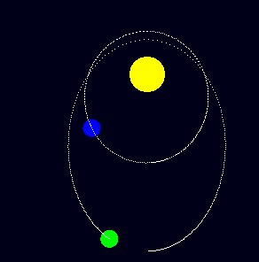

# Planetary Simulation
This project is a simple 2D and 3D planet simulation written in Java using LWJGL for rendering and OpenGL for graphics. The simulation allows you to visualize gravitational interactions between planets in both 2D and 3D space. You can switch between 2D and 3D rendering modes.

  

  3D Rendering mode.

  

  2D Rendering mode.

## Features

- **2D and 3D Rendering**: Switch between 2D and 3D modes to visualize planetary motion.
- **Gravitational Simulation**: Planets interact with each other based on Newton's law of universal gravitation.
- **Collision Detection**: Planets can collide and resolve collisions.
- **Camera Control (3D Mode)**: Move and rotate the camera to view the simulation from different angles.
- **User Interface**: Simple Swing-based UI to control the simulation.
